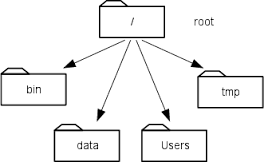

# Navigating Files and Directories

The part of the operating system responsible for managing files and directories is called the **file system**. It organizes our data into files, which hold information, and directories (also called "folders"), which hold files or other directories.

Several commands are frequently used to create, inspect, rename, and delete files and directories.
To start exploring them, let's open a shell window. When you have, you'll likely see a prompt with this:

~~~
$
~~~

The dollar sign is a **prompt**, which shows us that the shell is waiting for input. When typing commands, either from these lessons or from other sources, do not type the prompt, only the commands that follow it.

Let's try our first bit of interaction. Type the command `whoami`, then press the Enter key (sometimes marked Return) to send the command to the shell.
The command's output is the ID of the current user, i.e., it shows us who the shell thinks we are:

~~~
$ whoami
~~~

On my own machine, the output was as follows:

~~~
kshank
$
~~~

Pretty neat! What happened here? 

When we typed `whoami` the shell performed the following series of commands:

1.  found a program called `whoami`,
2.  ran that program,
3.  displayed that program's output
4.  displayed a new prompt to tell us that it's ready for more commands.

***

Next, let's find out where we are by running a command called `pwd` (which stands for "print working directory"). At any moment, our **current working directory** is our current default directory, i.e., the directory that the computer assumes we want to run commands in unless we explicitly specify something else. On my machine, the computer's response is `/Users/kshank`, which is my **home directory**:

~~~
$ pwd
~~~

~~~
/Users/kshank
~~~

### Home Directory Variation

The home directory path will look different on different operating systems. On Linux it may look like `/home/kshank`, and on Windows it will be similar to `C:\Documents and Settings\nkshank` or `C:\Users\kshank`. (Note that it may look slightly different for different versions of Windows.) In future examples, we've used Mac output as the default - Linux and Windows output may differ slightly, but should be generally similar.  

To understand what a "home directory" is, let's have a look at how the file system as a whole is organized.  For the sake of example, we'll be illustrating the filesystem on our scientist Nelle's computer.  After this illustration, you'll be learning commands to explore your own filesystem, which will be constructed in a similar way, but not be exactly identical.  

On Nelle's computer, the filesystem looks like this:

<kbd>
  
 </kbd>
 

At the top is the **root directory** that holds everything else. We refer to it using a slash character `/` on its own; this is the leading slash in `/Users/nelle`.

Inside that directory are several other directories: `bin` (which is where some built-in programs are stored), `data` (for miscellaneous data files), `Users` (where users' personal directories are located), `tmp` (for temporary files that don't need to be stored long-term), and so on.  

We know that our current working directory `/Users/nelle` is stored inside `/Users` because `/Users` is the first part of its name. Similarly, we know that `/Users` is stored inside the root directory `/` because its name begins with `/`.

